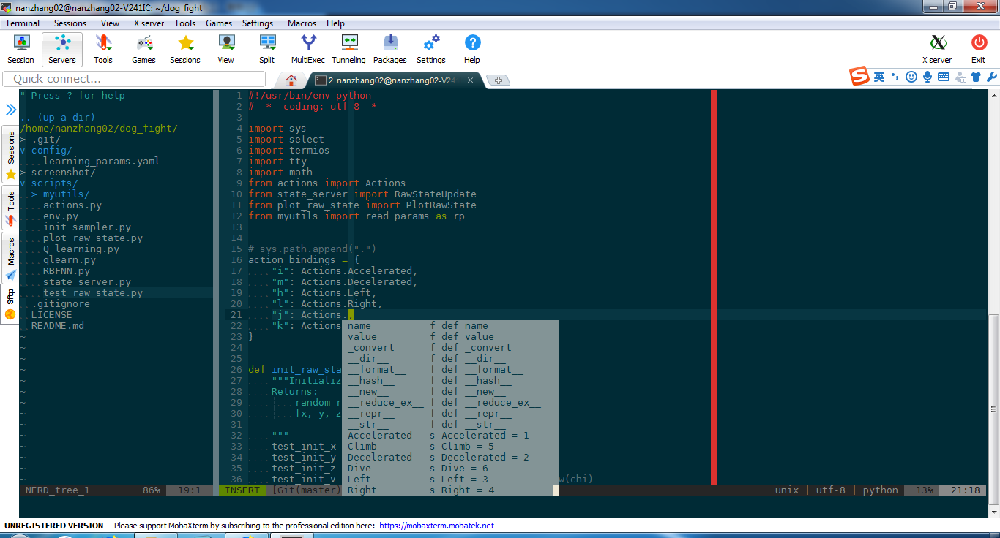

# Introduction

nan-vim is a private vim configuration which is welcome to be used by others.
It's designed for remote logins by SSH. 
This confiuration is tested on [MobaXterm][] based MS-Windows as local host 
and Ubuntu Server 16.04 as remote host.



# Installation
 
* Install plugins

```sh
git clone --recursive https://github.com/nannanmath/nan_vimrc.git ~/.nan_vimrc
cd .nan_vimrc
./install
```

* Install YouCompleteMe
 
Please refer to [YouCompleteMe][]

# Usage

* `<leader>` is `,`.

## Features

* Display & Basic Operation
  * Colorscheme & Status line.
    
    [Solarized][] Colorscheme with dark baclgroud.
    
    Status line is based on [lightline.vim][] plugin.
  
  * Cpp highlight enhanced by [vim-cpp-enhanced-highlight][].
  * Auto-completion for quotes, parens, brackets.
  * Incremental searching.
  * Auto-changing working directory to the project root.
  * Display the indention levels with thin vertical lines.
  * Highlight line and column of current cursor.
  * Limit line length for red color of the 80-th column.

* Resize and Maximize window

This feature is based on [vim-maximizer][] and [obvious-resize][].

| Shortcut             | Action                              |
| -------------------- | -----------------------             |
| `<C-Up>`             | Resize window up.                   |
| `<C-Down>`           | Resize window down.                 |
| `<C-Left>`           | Resize window left.                 |
| `<C-Right>`          | Resize window right.                |
| `<F4>`               | Toggle maximize / restore a window. |

* Directory explore

This feature is based on [NERD Tree][] plugin.

| Shortcut             | Action                                 |
| -------------------- | -----------------------                |
| `<F2>`               | Toggle NERD Tree                       |
| `s`                  | Open buffer in horizental split window |
| `v`                  | Open buffer in vertical split window   |

* Comment function

This feature is based on [NERD Commenter][] plugin.

| Shortcut             | Action                  |
| -------------------- | ----------------------- |
| `<leader>c<space>`   | Toggle comment state    |

More details can be found from [NERD Commenter][].

* Find

This feature is based on [CtrlP][] and [Ctrlp-funky][].

| Shortcut             | Action                            |
| -------------------- | -----------------------           |
| `<leader>p`          | Find file in a porject directory. |

* Buffers

This feature is based on [vim-buffergator][] and [vim-bufkill][].

| Shortcut             | Action                                      |
| -------------------- | -----------------------                     |
| `<leader>b`          | Toggle for listing all buffers in a window. |
| `<C-s>`              | Open buffer in horizental split window.     |
| `<C-v>`              | Open buffer in vertical split window.       |
| `<C-t>`              | Open buffer in a new tab.                   |
| `:BD`                | Wipe a file from buffer.                    |

More details can be found from [vim-bufkill][].

* Undo & Yank

This feature is based on [UndoTree][] and [YankRing][].

| Shortcut             | Action                        |
| -------------------- | -----------------------       |
| `<F6>`               | Show a Yank ring.             |
| `<F7>`               | Show a Undo tree in a window. |

* Snippets

This feature is based on [Unltisnips][] and [vim-snippets][].

| Shortcut             | Action                   |
| -------------------- | -----------------------  |
| `<Tab>`              | Snippets expand trigger. |
| `<C-f>`              | Snippets jump forward.   |
| `<C-b>`              | Snippets jump backward.  |

* Bookmark

This feature is based on [vim-bookmarks][].

| Shortcut             | Action                                  |
| -------------------- | -----------------------                 |
| `mm`                 | Add / Remove book mark at current line. |
| `mn`                 | Jump to next bookmark in buffer.        |
| `mp`                 | Jump tp previous bookmark in buffer.    |
| `ma`                 | Show all bookmarks.                     |
| `mc`                 | Clear bookmarks in current buffer.      |
| `mx`                 | Ckear all bookmarks.                    |

More details can be found from [vim-bookmarks][].

* Tabularize

This feature is based on [Tabular][].

| Shortcut             | Command                 |
| -------------------- | ----------------------- |
| `<C-l>`              | :Tabularize /           |

Input the character you want to align and press Enter.

* Region expand

This feature is based on [vim-region-expand][].

| Shortcut             | Action                   |
| -------------------- | -----------------------  |
| `+`                  | Expand selective region. |
| `_`                  | Narrow selective region. |

* Tabs

This feature is based on [Tabman][].

| Shortcut             | Action                                     |
| -------------------- | -----------------------                    |
| `<F3>`               | Toggle Tabman window for listing all tabs. |
| `<leader>tf`         | Focus on tabman window.                    |

* Python-IDE

This feature is based on [python-mode][]

| Shortcut             | Action                     |
| -------------------- | -----------------------    |
| `<leader>r`          | Run python code.           |
| `<leader>k`          | Set breakpoint.            |
| `T`                  | Show doc for current word. |


* Completion

This feature is based on [YouCompleteMe][].


| Shortcut             | Action                    |
| -------------------- | -----------------------   |
| `<C-a>`              | Invoke YCM Completion.    |
| `<Down>`             | List select completion.   |
| `Up`                 | List previous completion. |
| `<leader>j`          | Goto                      |

* Term

This feature is based on [conque-term][].

| Shortcut             | Action                  |
| -------------------- | ----------------------- |
| `<F8>`               | Open a term.            |

* Session

This feature is based on [vim-session][].

| Shortcut             | Command                 |
| -------------------- | ----------------------- |
| `<leader>ss`         | :SaveSession            |
| `<leader>so`         | :OpenSession            |
  
* Git

This feature is based on [fugitive][]

| Command              | Action                                             |
| -------------------- | -----------------------                            |
| `:Gstatus`           | Open window show `git status`.                     |
| `:Gdiff`             | Compare working copy / index or resolve conflicts. |

More details can be found from [fugitive][].
 
  
  [Solarized]: https://github.com/altercation/vim-colors-solarized
  [lightline.vim]: https://github.com/itchyny/lightline.vim
  [vim-cpp-enhanced-highlight]: https://github.com/octol/vim-cpp-enhanced-highlight
  [MobaXterm]: https://mobaxterm.mobatek.net
  [vim-maximizer]: https://github.com/szw/vim-maximizer
  [obvious-resize]: https://github.com/talek/obvious-resize
  [vim-windowswap]: https://github.com/wesq3/vim-windowswap
  [NERD Tree]: https://github.com/scrooloose/nerdtree
  [NERD Commenter]: https://github.com/scrooloose/nerdcommenter
  [CtrlP]: https://github.com/kien/ctrlp.vim
  [CtrlP-funky]: https://github.com/tacahiroy/ctrlp-funky
  [vim-buffergator]: https://github.com/jeetsukumaran/vim-buffergator
  [vim-bufkill]: https://github.com/qpkorr/vim-bufkill
  [UndoTree]: https://github.com/mbbill/undotree
  [YankRing]: https://github.com/vim-scripts/YankRing.vim
  [UltiSnips]: https://github.com/sirver/ultisnips
  [vim-snippets]: https://github.com/honza/vim-snippets
  [Tabular]: https://github.com/godlygeek/tabular
  [vim-expand-region]: https://github.com/terryma/vim-expand-region
  [vim-bookmarks]: https://github.com/mattesgroeger/vim-bookmarks
  [Tabman]: https://github.com/kien/tabman.vim
  [YouCompleteMe]: https://github.com/valloric/youcompleteme
  [python-mode]: https://github.com/python-mode
  [conque-term]: https://github.com/rosenfeld/conque-term
  [vim-session]: https://github.com/thaerkh/vim-workspace
  [fugitive]: https://github.com/tpope/vim-fugitive
